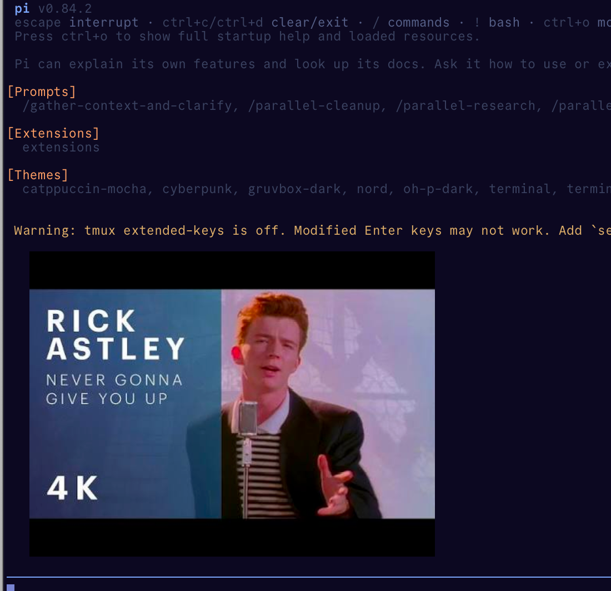

# pi-tmux-images

`pi-tmux-images` renders local images in the Pi TUI when Pi's normal image rendering is disabled inside tmux. It keeps the preview in the terminal UI; it does not attach an image or its bytes to model context.



The screenshot is a real Ghostty + tmux render of the original, reproducible `assets/demo-fixture.png` using Kitty Unicode placeholders.

## Quick start

Install from npm:

```sh
pi install npm:pi-tmux-images
pi
```

Until the first npm release, install the verified GitHub `main` branch instead:

```sh
pi install git:github.com/safurrier/pi-tmux-images@main
pi
```

From a local checkout:

```sh
cd /path/to/pi-tmux-images
pi -e .
```

Before starting Pi inside tmux, enable passthrough in `~/.tmux.conf` and start a new tmux server/session:

```tmux
set -g allow-passthrough on
```

Then add and clear a preview:

```text
/image /absolute/path/to/image.png
/image clear
```

## Rendering and compatibility

| Environment | Result |
| --- | --- |
| Ghostty in tmux with `allow-passthrough on` | Kitty upload plus Unicode placeholders, so tmux owns placement. |
| Kitty outside tmux | Pi's image component. |
| Other image-capable terminals outside tmux (including WezTerm when Pi exposes an image protocol) | Pi's image component. |
| tmux without passthrough, GNU Screen, or no image protocol | A readable text notice; no image is sent. |

PNG, JPEG, and WebP inputs are supported. Images are normalized to PNG for terminal transport. A preview is limited to 20 MB of source data and 32 decoded megapixels; a session keeps at most 16 active previews. The validated baseline is Pi 0.84.2 on Node >=22.19.0; bundled Pi core peers intentionally use `*` so compatible later Pi releases are not artificially excluded.

## Privacy and session behavior

`/image` creates a Pi custom transcript entry, not a chat message. The model and saved session context receive neither the source file nor normalized PNG bytes. Session data contains the path, source hash, original MIME type, dimensions, and a durable logical ID. Normalized PNG bytes are transmitted through tmux and the terminal to render a preview, so they may appear in terminal logs; process memory owns the cached bytes and terminal image IDs. If a saved source changes or disappears, Pi shows a readable notice instead of reusing it.

## Limits and troubleshooting

- If tmux shows text instead of an image, add `set -g allow-passthrough on`, then restart tmux and Pi. The setting must apply to the server running Pi.
- `/image clear` removes this package's active previews and deletes only terminal IDs allocated by this runtime.
- On pane resize, the extension replaces its Kitty virtual placement for the new cell geometry. Resize once after adding an image to confirm placement follows the pane; clear it if a terminal has retained stale pixels.
- GNU Screen is intentionally a text fallback. The extension does not try to tunnel Kitty graphics through it.
- Use an absolute path when the working directory is not obvious. Unsupported, unreadable, oversized, or invalid images report an error in Pi.

## How it works

In the supported tmux path, the extension uploads a normalized image through Kitty graphics, creates a virtual placement, and renders Kitty Unicode placeholder cells in Pi's custom entry. This gives tmux the text grid it needs to move and clear the preview safely. Outside tmux, it uses Pi's native image component when available.

## License and security

This project is licensed under [MIT](LICENSE). Pi packages run with the permissions of the user process, so install packages only from sources you trust. The model/session isolation above does not prevent terminals, tmux, or terminal logging from receiving preview bytes.

## Development

```sh
mise run setup
mise run check
mise run verify
```

`mise run check` runs formatting, linting, TypeScript, unit/release-contract tests, and an `npm pack --dry-run` boundary check. `mise run verify` additionally installs the packed tarball in an isolated temporary project and runs the isolated tmux raw-terminal smoke. The smoke proves upload, virtual placement, placeholder, and owned-ID cleanup sequences; it does not prove pixels. For the required visual Ghostty + tmux capture, follow [assets/README.md](assets/README.md).
