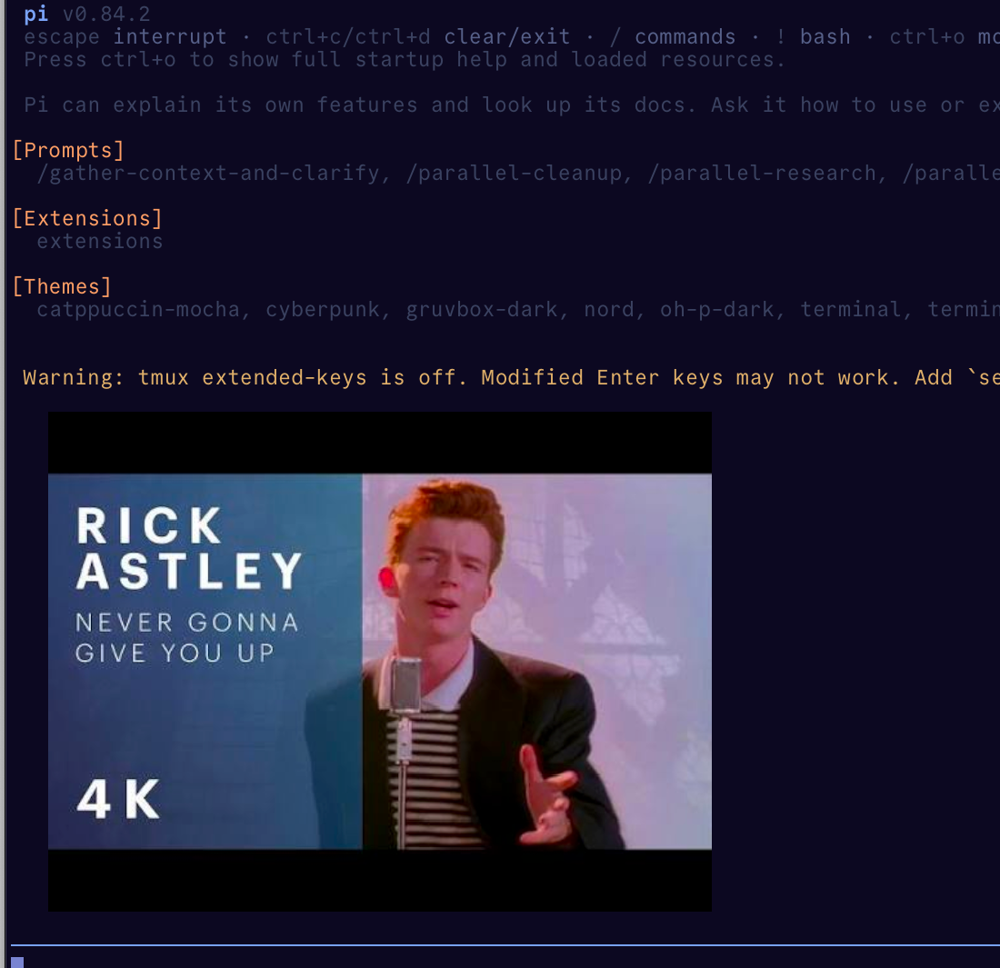

# pi-tmux-images

`pi-tmux-images` shows local images in Pi's terminal user interface (TUI) when Pi runs inside tmux. The preview stays in the terminal UI. The extension never attaches image bytes to model context.



This screenshot is a real Ghostty and tmux render. It uses the checked-in `assets/demo-fixture.jpg` and Kitty Unicode placeholders.

## Quick start

Install the extension from npm:

```sh
pi install npm:pi-tmux-images
```

Before you start Pi inside tmux, add this line to `~/.tmux.conf`:

```tmux
set -g allow-passthrough on
```

Start a new tmux server or session so the setting takes effect. Then run Pi and show an image:

```sh
pi
```

```text
/image /absolute/path/to/image.png
```

Remove the preview when you finish:

```text
/image clear
```

A successful preview appears inside the Pi transcript. In supported tmux sessions, image attachments already present in user messages and tool results also receive a preview automatically; their original message blocks remain available to Pi and the model. If you see a text notice instead, check [Limits and troubleshooting](#limits-and-troubleshooting).

### Other install paths

Install the current GitHub `main` branch:

```sh
pi install git:github.com/safurrier/pi-tmux-images@main
pi
```

Run the extension from a local checkout:

```sh
cd /path/to/pi-tmux-images
pi -e .
```

## Rendering and compatibility

| Environment | Result |
| --- | --- |
| Ghostty in tmux with `allow-passthrough on` | Kitty upload plus Unicode placeholders, so tmux owns placement. |
| Kitty outside tmux | Pi's image component. |
| Other image-capable terminals outside tmux, including WezTerm when Pi exposes an image protocol | Pi's image component. |
| tmux without passthrough, GNU Screen, or no image protocol | Automatic previews do nothing; `/image` shows a readable text notice and sends no image. |

The extension accepts PNG, JPEG, and WebP files. It converts each image to PNG before sending it to the terminal.

Limits protect the Pi process and terminal:

- Each source file can use up to 20 MB.
- Each decoded image can contain up to 32 megapixels.
- Each session can keep up to 16 active previews.

The validated baseline is Pi 0.84.2 on Node >=22.19.0. The bundled Pi core peer ranges use `*`. This allows compatible later Pi releases instead of excluding them without evidence.

## Privacy and saved sessions

`/image` creates a custom transcript entry rather than a chat message.

- The model receives neither the source file nor the converted PNG bytes.
- `/image` saves the path, source hash, original media type, dimensions, and a stable logical ID.
- Automatic previews save only stable origin metadata, block index, and hashes; they do not duplicate image base64 in custom entries. On restore, Pi resolves the original branch message again. Because Pi's finalized-message hook precedes persistence, an automatic preview entry can appear immediately before its source message in a restored transcript. If another extension later replaces the source image, this preview refuses to rehydrate it.
- The extension sends converted PNG bytes through tmux to the terminal. Those bytes may appear in terminal logs.
- The running extension owns the cached bytes and terminal image IDs.

If the source changes or disappears, Pi shows a text notice. It never displays new file contents under an old saved entry.

## Limits and troubleshooting

- If tmux shows text instead of an image, add `set -g allow-passthrough on`. Then restart tmux and Pi. The setting must apply to the tmux server that runs Pi.
- `/image clear` removes this package's active previews. It deletes only terminal IDs allocated by this runtime.
- When the pane changes size, the extension replaces its Kitty placement with the new cell geometry. Resize once after adding an image to confirm that the preview follows the pane. Clear the preview if a terminal keeps stale pixels.
- GNU Screen uses the text fallback. The extension never tunnels Kitty graphics through it.
- Use an absolute path when the working directory isn't clear. Pi reports unsupported, unreadable, oversized, or invalid images as errors.

## How it works

Inside supported tmux sessions, the extension uploads a converted image through Kitty graphics. It creates a virtual placement and renders Kitty Unicode placeholder cells in Pi's custom entry. The text grid lets tmux move and clear the preview safely.

Outside tmux, the extension uses Pi's native image component when one is available.

## License and security

The project uses the [MIT license](LICENSE). Pi packages run with your user permissions, so install packages only from sources you trust.

Model and session isolation don't stop the terminal or tmux from receiving preview bytes. Terminal logging may also retain those bytes.

## Development

Install dependencies and run the local checks:

```sh
mise run setup
mise run check
mise run verify
```

`mise run check` covers formatting, linting, TypeScript, unit and release-contract tests, and the packed-file boundary. `mise run verify` also installs the packed package in a temporary project. It then runs an isolated tmux raw-terminal smoke test.

The smoke test checks upload, placement, placeholder, and owned-ID cleanup sequences. It doesn't prove that the pixels look correct. Follow [assets/README.md](assets/README.md) for the required visual Ghostty and tmux capture.

To manually verify automatic previews in an isolated profile, run `tmp=$(mktemp -d); PI_CODING_AGENT_DIR="$tmp/agent" pi install /path/to/pi-tmux-images`, then start `tmux -L pi-images new -s pi-images` after setting `allow-passthrough on`. Inside that pane, launch `PI_CODING_AGENT_DIR="$tmp/agent" pi`, attach a PNG to a user prompt (or use a tool that returns an image block), and confirm one preview per block. `/image clear` should remove only this extension's IDs. This is a pixel check; raw Kitty protocol output alone is byte-level evidence, not proof of visible pixels.

### Plan a future release

Preview a stable release without changing files or contacting external services:

```sh
mise run release -- 0.1.1
```

After the changelog entry lands on a clean, current `main`, start the external-effect path:

```sh
mise run release -- 0.1.1 --execute
```

This path commits and publishes the release. It never reads or stores npm tokens or one-time passwords (OTPs). [RELEASING.md](RELEASING.md) explains its checks, effects, recovery steps, and one-time npm bootstrap history.
